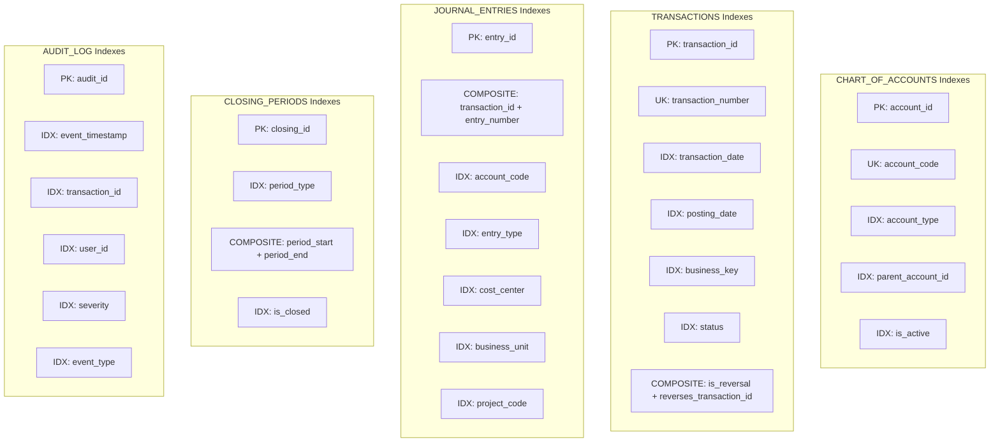
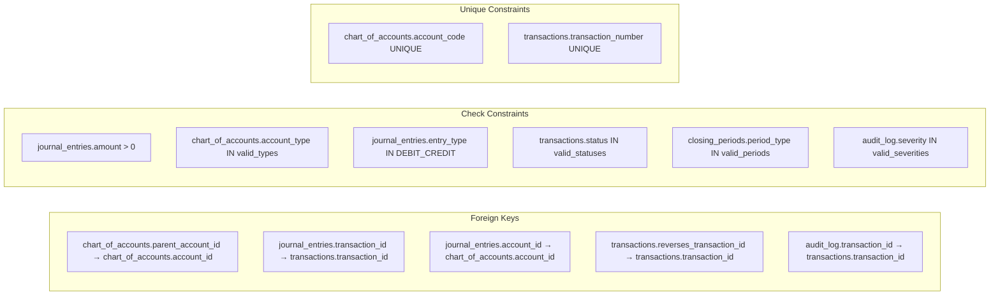

```mermaid
---
title: Ledger System - Complete Database Schema
---
erDiagram
    CHART_OF_ACCOUNTS {
        VARCHAR_36 account_id PK "Identificador único UUID"
        VARCHAR_50 account_code UK "Código único da conta"
        VARCHAR_200 account_name NOT_NULL "Nome descritivo da conta"
        VARCHAR_20 account_type NOT_NULL "Tipo: ASSET|LIABILITY|EQUITY|REVENUE|EXPENSE"
        VARCHAR_36 parent_account_id FK_NULL "Referência à conta pai (hierarquia)"
        NUMERIC_2_0 level NOT_NULL "Nível hierárquico (1 a 99)"
        BOOLEAN is_active DEFAULT_TRUE "Status ativo/inativo"
        TEXT description NULL "Descrição detalhada da conta"
        DATETIME created_at NOT_NULL "Timestamp UTC de criação"
        VARCHAR_200 created_by NOT_NULL "Identificação do usuário criador"
        NUMERIC_10_0 version DEFAULT_1 "Versão do registro (controle)"
    }
    
    TRANSACTIONS {
        VARCHAR_36 transaction_id PK "Identificador único UUID"
        VARCHAR_50 transaction_number UK "Número sequencial YYYYMMDD-NNNNNN"
        DATETIME transaction_date NOT_NULL "Data do evento econômico (UTC)"
        DATETIME posting_date NULL "Data de lançamento contábil (UTC)"
        VARCHAR_100 business_event_type NOT_NULL "Tipo de evento (SALE|PAYMENT|ADJUSTMENT)"
        VARCHAR_200 business_key NULL "Chave de negócio externa"
        VARCHAR_100 reference_number NULL "Número de referência do documento"
        TEXT description NOT_NULL "Descrição detalhada da transação"
        VARCHAR_20 status DEFAULT_PENDING "Status: PENDING|POSTED|REVERSED|CANCELLED"
        BOOLEAN is_reversal DEFAULT_FALSE "Flag indicador de reversão"
        VARCHAR_36 reverses_transaction_id FK_NULL "ID da transação que está sendo revertida"
        VARCHAR_36 reversed_by_transaction_id NULL "ID da transação que reverteu esta"
        TEXT reversal_reason NULL "Justificativa da reversão"
        DATETIME created_at NOT_NULL "Timestamp UTC de criação"
        VARCHAR_200 created_by NOT_NULL "Identificação do usuário criador"
        VARCHAR_100 source_system NOT_NULL "Sistema de origem da transação"
        VARCHAR_45 source_ip NULL "Endereço IP de origem"
        VARCHAR_64 transaction_hash NOT_NULL "Hash SHA-256 para integridade"
    }
    
    JOURNAL_ENTRIES {
        VARCHAR_36 entry_id PK "Identificador único UUID"
        VARCHAR_36 transaction_id FK_NOT_NULL "Referência à transação pai"
        NUMERIC_5_0 entry_number NOT_NULL "Número sequencial da linha (1,2,3...)"
        VARCHAR_36 account_id FK_NOT_NULL "Referência à conta contábil"
        VARCHAR_50 account_code NOT_NULL "Código da conta (desnormalizado)"
        VARCHAR_10 entry_type NOT_NULL "Tipo: DEBIT ou CREDIT"
        NUMERIC_20_2 amount NOT_NULL_CHK_GT_0 "Valor do lançamento (sempre positivo)"
        VARCHAR_3 currency DEFAULT_AOA "Código moeda ISO-4217 (AOA|USD|EUR)"
        VARCHAR_50 cost_center NULL "Centro de custo (dimensão analítica)"
        VARCHAR_50 business_unit NULL "Unidade de negócio (dimensão analítica)"
        VARCHAR_50 project_code NULL "Código do projeto (dimensão analítica)"
        TEXT memo NULL "Observações/memo do lançamento"
        DATETIME created_at NOT_NULL "Timestamp UTC de criação"
    }
    
    CLOSING_PERIODS {
        VARCHAR_36 closing_id PK "Identificador único UUID"
        VARCHAR_20 period_type NOT_NULL "Tipo: DAILY|MONTHLY|QUARTERLY|ANNUAL"
        DATETIME period_start NOT_NULL "Data/hora início do período (UTC)"
        DATETIME period_end NOT_NULL "Data/hora fim do período (UTC)"
        BOOLEAN is_closed DEFAULT_FALSE "Flag: período está fechado?"
        DATETIME closed_at NULL "Timestamp UTC do fechamento"
        VARCHAR_200 closed_by NULL "Usuário que executou o fechamento"
        NUMERIC_20_2 total_debits NULL "Snapshot: total de débitos do período"
        NUMERIC_20_2 total_credits NULL "Snapshot: total de créditos do período"
        BOOLEAN balance_check NULL "Snapshot: débitos = créditos?"
        DATETIME created_at NOT_NULL "Timestamp UTC de criação"
    }
    
    AUDIT_LOG {
        VARCHAR_36 audit_id PK "Identificador único UUID"
        DATETIME event_timestamp NOT_NULL "Timestamp UTC do evento auditado"
        VARCHAR_100 event_type NOT_NULL "Categoria do evento (ACCOUNT_CREATED|TRANSACTION_POSTED)"
        VARCHAR_20 severity NOT_NULL "Severidade: INFO|WARNING|ERROR|CRITICAL"
        VARCHAR_36 transaction_id FK_NULL "Referência à transação (se aplicável)"
        VARCHAR_200 user_id NOT_NULL "Identificação do usuário/sistema"
        VARCHAR_100 source_system NOT_NULL "Sistema de origem do evento"
        VARCHAR_45 source_ip NULL "Endereço IP de origem"
        VARCHAR_100 action NOT_NULL "Ação executada (CREATE|UPDATE|DELETE|REVERSE)"
        VARCHAR_50 entity_type NULL "Tipo de entidade afetada"
        VARCHAR_36 entity_id NULL "ID da entidade afetada"
        TEXT description NOT_NULL "Descrição detalhada do evento"
        TEXT metadata NULL "Contexto adicional em formato JSON"
    }

    %% Relacionamentos
    CHART_OF_ACCOUNTS ||--o{ CHART_OF_ACCOUNTS : "parent_account_id (hierarquia)"
    CHART_OF_ACCOUNTS ||--o{ JOURNAL_ENTRIES : "account_id (lançamentos na conta)"
    
    TRANSACTIONS ||--|{ JOURNAL_ENTRIES : "transaction_id (contém lançamentos)"
    TRANSACTIONS ||--o| TRANSACTIONS : "reverses_transaction_id (reversão)"
    TRANSACTIONS ||--o{ AUDIT_LOG : "transaction_id (eventos auditados)"
    
    CLOSING_PERIODS ||--o{ TRANSACTIONS : "period_dates (agrupa transações)"
```

## 🔍 Legendas e Convenções

### Tipos de Dados

| Tipo | Formato | Descrição | Exemplo |
|------|---------|-----------|---------|
| VARCHAR_36 | VARCHAR(36) | UUID padrão | `550e8400-e29b-41d4-a716-446655440000` |
| VARCHAR_50 | VARCHAR(50) | Código/identificador curto | `ACC-1100` |
| VARCHAR_200 | VARCHAR(200) | Nome/descrição média | `Caixa e Equivalentes` |
| NUMERIC_2_0 | NUMERIC(2,0) | Número inteiro pequeno | `1`, `2`, `99` |
| NUMERIC_5_0 | NUMERIC(5,0) | Número inteiro médio | `1`, `2`, `99999` |
| NUMERIC_10_0 | NUMERIC(10,0) | Número inteiro grande | `1`, `2`, `9999999999` |
| NUMERIC_20_2 | NUMERIC(20,2) | Valor monetário | `1234.56`, `9999999.99` |
| DATETIME | DATETIME(timezone) | Data/hora com timezone | `2026-01-31 10:30:45 UTC` |
| BOOLEAN | BOOLEAN | Verdadeiro/Falso | `TRUE`, `FALSE` |
| TEXT | TEXT | Texto longo sem limite | Descrições, JSON, etc |

### Sufixos de Constraint

| Sufixo | Significado | Descrição |
|--------|-------------|-----------|
| PK | Primary Key | Chave primária |
| UK | Unique Key | Valor único na tabela |
| FK | Foreign Key | Chave estrangeira |
| FK_NULL | Foreign Key Nullable | Chave estrangeira que pode ser NULL |
| FK_NOT_NULL | Foreign Key Not Null | Chave estrangeira obrigatória |
| NOT_NULL | Not Null | Campo obrigatório |
| NULL | Nullable | Campo opcional |
| DEFAULT_X | Default Value | Valor padrão = X |
| CHK_GT_0 | Check Greater Than 0 | Validação > 0 |

### Cardinalidades nos Relacionamentos

| Símbolo | Significado |
|---------|-------------|
| `||` | Exatamente um |
| `|o` | Zero ou um |
| `}{` | Um ou muitos |
| `}o` | Zero ou muitos |

## 📐 Diagrama de Índices



## 🔐 Diagrama de Constraints



## 💾 Estimativa de Tamanho de Dados

### Tamanho Médio por Registro

| Tabela | Bytes/Registro | Estimativa |
|--------|----------------|------------|
| CHART_OF_ACCOUNTS | ~500 bytes | 500 contas = 250 KB |
| TRANSACTIONS | ~800 bytes | 1M transações = 800 MB |
| JOURNAL_ENTRIES | ~300 bytes | 2M lançamentos = 600 MB |
| CLOSING_PERIODS | ~200 bytes | 1000 períodos = 200 KB |
| AUDIT_LOG | ~600 bytes | 5M eventos = 3 GB |

### Projeção de Crescimento (1 ano)

| Volume | TRANSACTIONS | JOURNAL_ENTRIES | AUDIT_LOG | Total Estimado |
|--------|--------------|-----------------|-----------|----------------|
| Baixo (10K/dia) | ~3M = 2.4 GB | ~6M = 1.8 GB | ~15M = 9 GB | ~13 GB |
| Médio (100K/dia) | ~30M = 24 GB | ~60M = 18 GB | ~150M = 90 GB | ~132 GB |
| Alto (1M/dia) | ~300M = 240 GB | ~600M = 180 GB | ~1.5B = 900 GB | ~1.3 TB |

*Estimativas incluem índices e consideram fator de 1.5x para overhead*

## 🎯 Estratégias de Particionamento

```sql
-- Particionamento de TRANSACTIONS por ano
ALTER TABLE transactions
PARTITION BY RANGE (YEAR(transaction_date)) (
    PARTITION p2024 VALUES LESS THAN (2025),
    PARTITION p2025 VALUES LESS THAN (2026),
    PARTITION p2026 VALUES LESS THAN (2027),
    PARTITION p_future VALUES LESS THAN MAXVALUE
);

-- Particionamento de AUDIT_LOG por mês
ALTER TABLE audit_log
PARTITION BY RANGE (TO_DAYS(event_timestamp)) (
    PARTITION p202401 VALUES LESS THAN (TO_DAYS('2024-02-01')),
    PARTITION p202402 VALUES LESS THAN (TO_DAYS('2024-03-01')),
    -- ... continuar para cada mês
);
```
